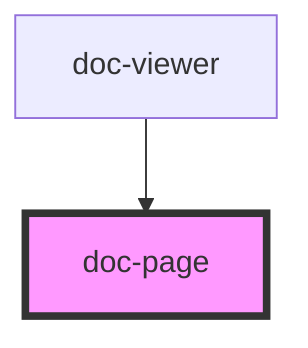

# doc-page

<!-- Auto Generated Below -->

## Properties

| Property            | Attribute     | Description | Type                                             | Default     |
| ------------------- | ------------- | ----------- | ------------------------------------------------ | ----------- |
| `activeTool`        | `active-tool` |             | `"comment" \| "highlight" \| "note" \| "select"` | `'select'`  |
| `annotations`       | --            |             | `NormalizedRect[]`                               | `[]`        |
| `comments`          | --            |             | `PageComment[]`                                  | `[]`        |
| `fileType`          | `file-type`   |             | `"image" \| "pdf" \| "text"`                     | `'pdf'`     |
| `page` _(required)_ | `page`        |             | `number`                                         | `undefined` |
| `readOnly`          | `read-only`   |             | `boolean`                                        | `false`     |
| `scale`             | `scale`       |             | `number`                                         | `1.2`       |
| `src` _(required)_  | `src`         |             | `string`                                         | `undefined` |
| `visible`           | `visible`     |             | `boolean`                                        | `false`     |

## Events

| Event                 | Description | Type                                                                         |
| --------------------- | ----------- | ---------------------------------------------------------------------------- |
| `annotationCreated`   |             | `CustomEvent<{ page: number; rect: NormalizedRect; }>`                       |
| `commentAddRequested` |             | `CustomEvent<{ page: number; x: number; y: number; kind: AnnotationKind; }>` |
| `commentIconClicked`  |             | `CustomEvent<{ page: number; commentId: string; }>`                          |

## Dependencies

### Used by

 - [doc-viewer](../doc-viewer)

### Graph

----------------------------------------------

*Built with [StencilJS](https://stenciljs.com/)*
