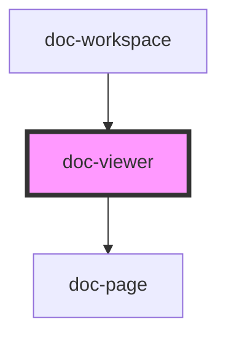

# doc-viewer

<!-- Auto Generated Below -->

## Properties

| Property           | Attribute   | Description | Type                           | Default     |
| ------------------ | ----------- | ----------- | ------------------------------ | ----------- |
| `embedded`         | `embedded`  |             | `boolean`                      | `false`     |
| `fileType`         | `file-type` |             | `"image" \| "pdf" \| "text"`   | `'pdf'`     |
| `mode`             | `mode`      |             | `"editor" \| "viewer"`         | `'editor'`  |
| `scale`            | `scale`     |             | `number`                       | `1.2`       |
| `src` _(required)_ | `src`       |             | `string`                       | `undefined` |
| `theme`            | `theme`     |             | `"dark" \| "light" \| "sepia"` | `'light'`   |

## Dependencies

### Used by

 - [doc-workspace](../doc-workspace)

### Depends on

- [doc-page](../doc-page)

### Graph

----------------------------------------------

*Built with [StencilJS](https://stenciljs.com/)*
